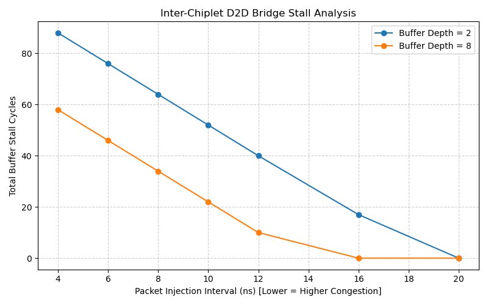

# Cycle-Approximate D2D Chiplet Interconnect Performance Model

A SystemC TLM-2.0 cycle-approximate performance model evaluating Die-to-Die (D2D) communication bottlenecks, buffer sizing, and credit-based flow control across modular chiplet boundaries.

## Architecture
- **Initiator (Chiplet 0):** Configurable packet injection rate with non-blocking retry handshaking.
- **D2D Bridge:** Pipelined packet serialization, link propagation delay modeling, and credit tracking backpressure.
- **Target (Chiplet 1):** Memory sink processing requests and terminating TLM transactions.

## Results
Increasing ingress buffer depth from 2 to 8 entries significantly relieves head-of-line backpressure, lowering the congestion-free threshold from 20ns to 16ns.



## Build & Run
```bash
mkdir -p build && cd build
cmake ..
make -j$(nproc)
../run_experiments.sh
python3 ../plot_results.py
