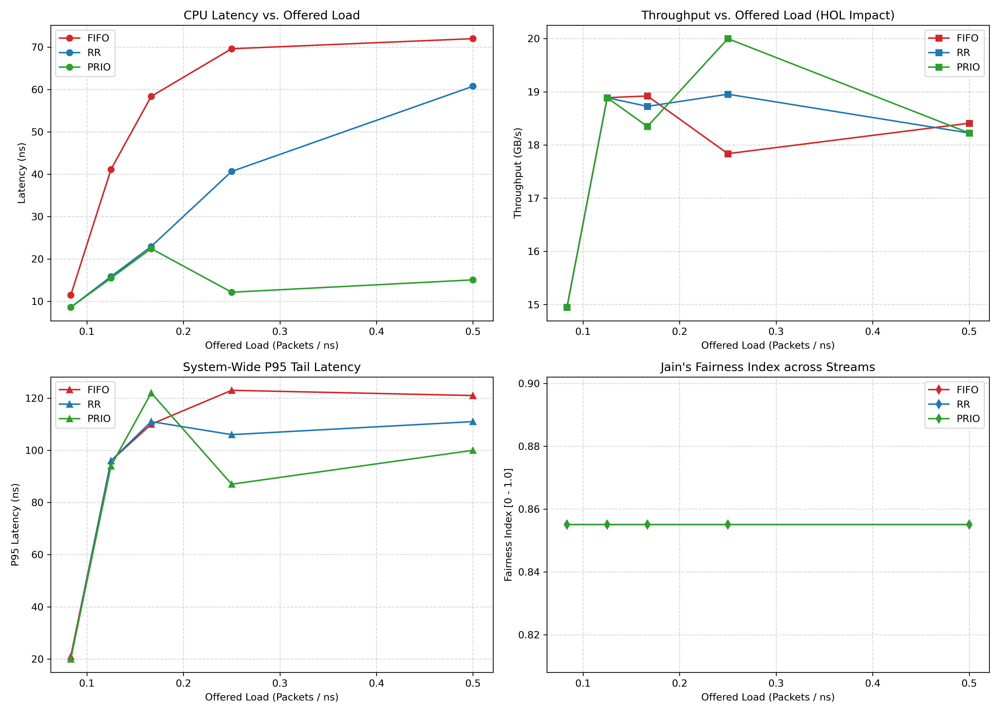
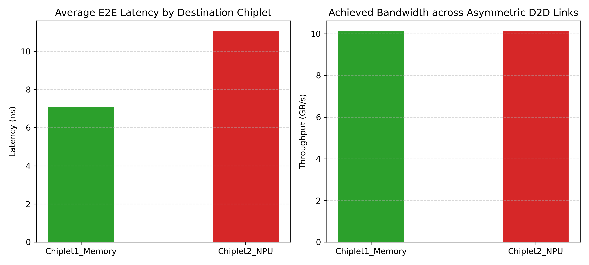

# Cycle-Approximate Chiplet D2D Interconnect Performance Modeling Framework

A modular, cycle-approximate architectural performance model of a multi-chiplet System-on-Chip (SoC) interconnect implemented in **SystemC / TLM-2.0**.

The framework evaluates communication strategies across modular chiplet boundaries, focusing on **Head-of-Line (HOL) blocking**, **credit-based flow control**, **arbitration policies**, and **asymmetric PHY links**.

---

## Architecture Topology

```
source Chiplet 0 (CPU / DMA)
                  |
            F2F Drd-Router
                 /     \
    64 GB/s PHY  ,       .   16 GB/s PHY
               ,           .
              v             v
     Chiplet 1 (Memory)     Chiplet 2 (NPU)
```

---

## Architectural Features

1. **Explicit Credit-Based Flow Control:**
   - Non-blocking TLM-2.0 transport (`nb_transport_fw`).
    - Dedicated credit-return channel (`nb_transport_bw`) emitting `CREDIT_RETURN` phases when downstream buffer slots are freed, preventing buffer overflow under burst loads.

2. **Arbitration & HOL Blocking Exploration:**
    - **FIFO:** Single shared ingress queue; models severe Head-of-Line blocking when packets destined for the slower NPU block subsequent memory transactions.
    - **Round-Robin (RR):** Segregated queues per stream, ensuring fair channel allocation.
    - **Strict-Priority (PRIO):** Priority scheduler granting strict priority scheduling to latency-critical CPU traffic over bulk DMA streams.

3. **Heterogeneous Physical Layer (PHY):**
    - Analytical packet serialization latency (Tjer = Packet Size / Bandwidth).
    - Independent cross-die propagation delay.

---

## Experimental Results

### Arbitration & Contention Analysis


Under high injection rates (2.0 ns offered interval):
- **FIFO:** Severe contention and HOL blocking push CPU latency to **72.0 ns**.
- **Round-Robin:** Interleaved queueing brings CPU latency down to **60.76 ns**.
- **Strict Priority:** CPU traffic prioritizes CPU over bulk DMA transfers, slashing CPU latency to **15.06 ns** (a **79% improvement** over FIFO).

### Throughput Saturation & Link Asymmetry

- **Memory Link (64 GB/s):** Average latency of **7.08 ns**.
- **NPU Link (16 GB/s):** Average latency of **11.05 ns** (+56% penalty due to link serialization constraints).

---

## Build & Run

```bash
mkdir -p build && cd build
cmake .. -DSYSTEMC_PREFIX=/opt/systemc
make -j$(nproc)

cd ..
./run_experiments.sh
python3 plot_arbitration.py
python3 plot_topology.py
```
